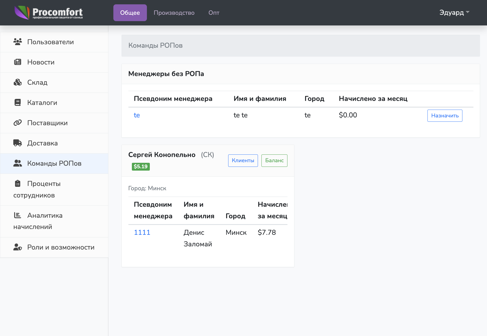
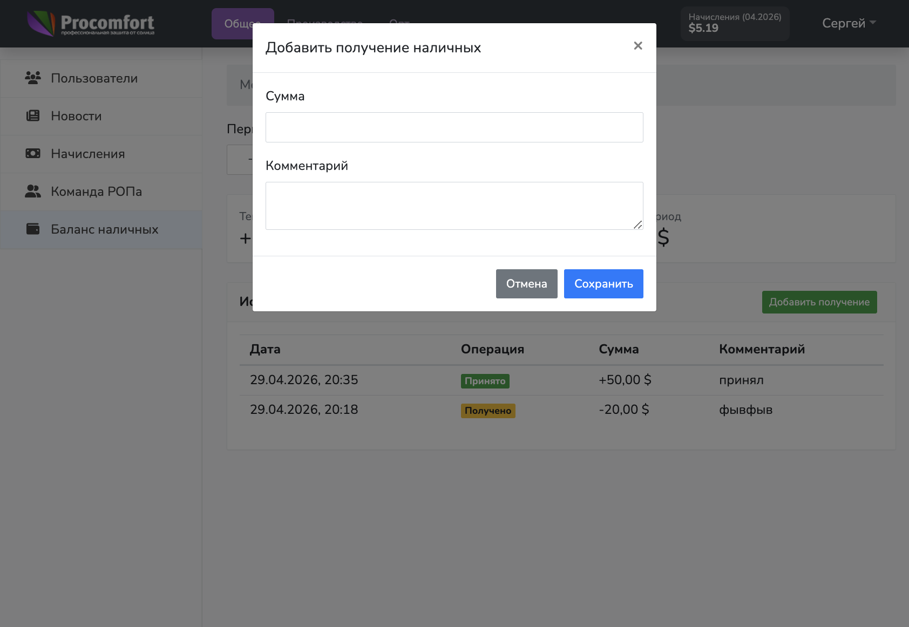
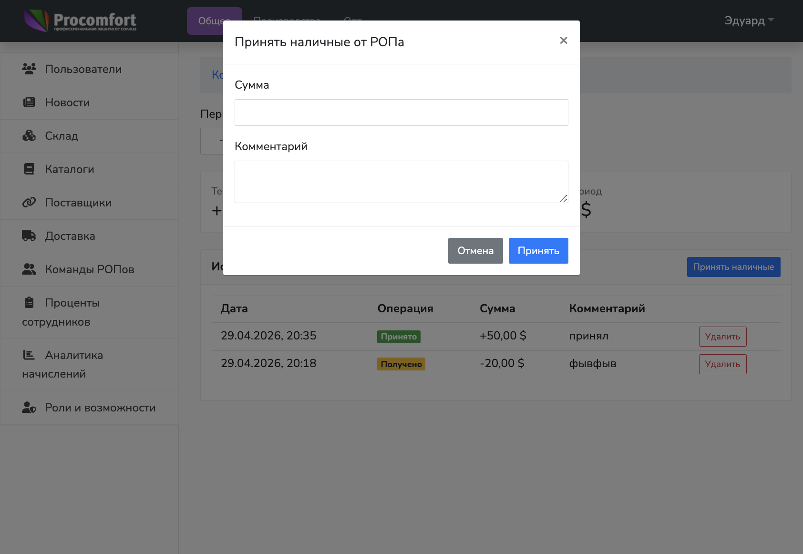
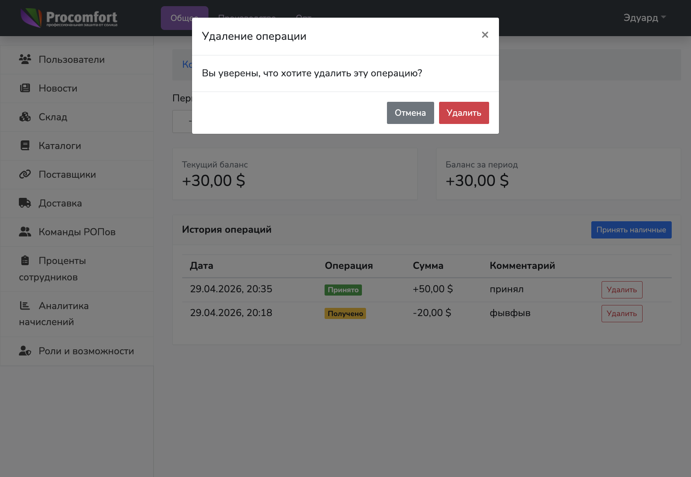

# Инструкция по работе с балансом РОПа

> **Для кого:** РОП, администратор  
> **Техническая документация** (procomfort-api): [HLD](https://github.com/Eddie344/procomfort-api/blob/main/docs/features/rop-balance/HLD.md) · [Требования](https://github.com/Eddie344/procomfort-api/blob/main/docs/features/rop-balance/requirements.md) · [План работ](https://github.com/Eddie344/procomfort-api/blob/main/docs/features/rop-balance/tasks.md) · [Тест-кейсы](https://github.com/Eddie344/procomfort-api/blob/main/docs/features/rop-balance/test-cases.md)

## 1. Что это за модуль

Модуль `Баланс РОПа` учитывает только наличные операции:

- `Получено` (`received`) — РОП принял наличные от клиента, а система автоматически записала долг РОПа;
- `Принято` (`deposited`) — администратор принял наличные от РОПа.

Текущий баланс считается по формуле:

`balance = deposited - received`

Если баланс отрицательный, это означает, что РОП должен эту сумму владельцу.

## 2. Где находится в интерфейсе

- **РОП:** существующая модалка изменения баланса в карточке клиента.
- **Администратор:** `Команды РОПов` -> кнопка `Баланс` в карточке нужного РОПа.

## 3. Работа РОПа

### 3.1 Зафиксировать наличную оплату клиента

1. Открыть нужного клиента.
2. Нажать `Изменить` в блоке баланса клиента.
3. Выбрать тип операции `Пополнение`.
4. В типе платежа выбрать `Наличный`.
5. Заполнить сумму и при необходимости комментарий.
6. Нажать `Сохранить`.

Результат:

- баланс клиента меняется на сумму оплаты;
- в истории операций клиента отображается тип платежа `Наличный`;
- в балансе РОПа автоматически появляется операция `Получено`;
- сумма операции увеличивает долг РОПа перед владельцем.

Важно:

- РОП не видит свой баланс и историю операций баланса РОПа;
- пополнение с типом платежа `Безналичный` не создает операцию баланса РОПа.

## 4. Работа администратора

### 4.1 Принять наличные от РОПа

1. Открыть баланс нужного РОПа.
2. Нажать `Принять наличные`.
3. Ввести сумму и комментарий (при необходимости).
4. Нажать `Принять`.

Результат:

- в истории появляется операция `Принято`;
- сумма операции увеличивает баланс.

Важно:

- принять можно только сумму, которую РОП должен владельцу;
- если баланс РОПа `-500`, максимальная сумма приема — `500`;
- если баланс РОПа `0`, принять наличные нельзя.

### 4.2 Удалить ошибочную операцию

Удаление доступно только администратору.

1. В строке операции нажать `Удалить`.
2. Подтвердить удаление в модальном окне.

Результат:

- операция скрывается из текущей истории и не влияет на расчет баланса;
- запись удаляется мягко (soft-delete) и сохраняет автора удаления (`deleted_by`).

## 5. Ограничения доступа

- РОП не видит свой баланс и операции баланса РОПа.
- РОП не может удалять операции баланса.
- Администратор работает только с выбранным РОПом в admin-режиме.

## 6. Частые вопросы

**Почему баланс отрицательный?**  
Это нормальная ситуация: РОП принял наличные от клиента, но еще не передал их владельцу.

**Почему администратор не может принять сумму больше долга РОПа?**  
Баланс РОПа не должен становиться больше `0`: администратор фиксирует только фактически переданные наличные в пределах текущей задолженности.

**Почему не видно удаленную операцию?**  
Удаленные администратором операции скрываются из рабочего списка, так как удаляются через soft-delete.

**Что делать при ошибке суммы?**  
Администратор удаляет ошибочную запись и создает корректную операцию заново.
