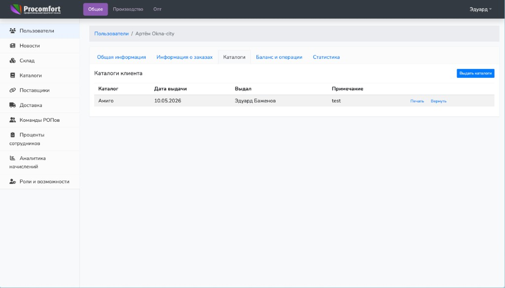
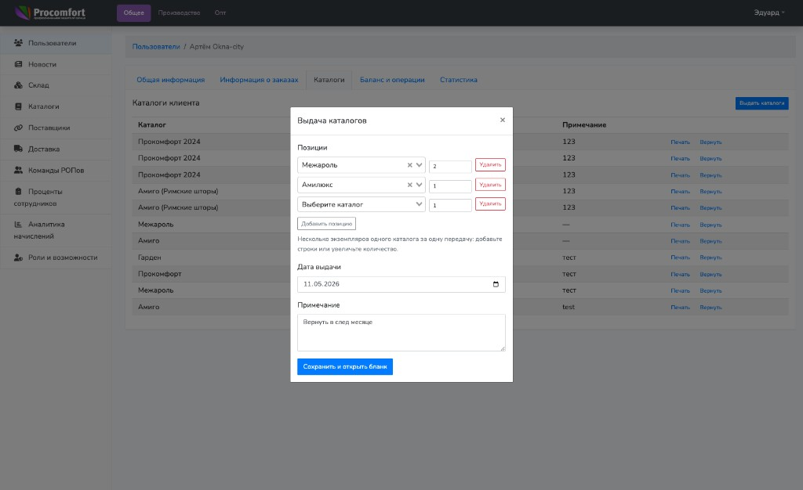
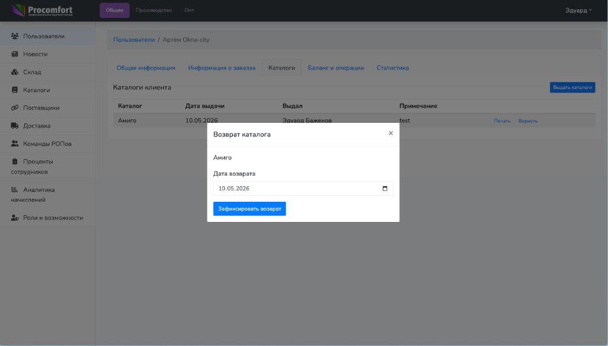
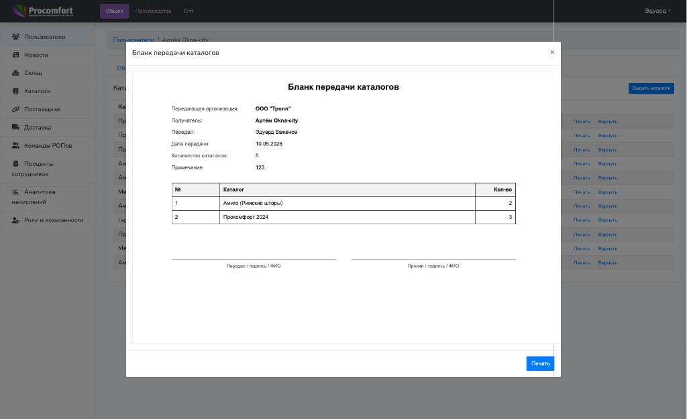
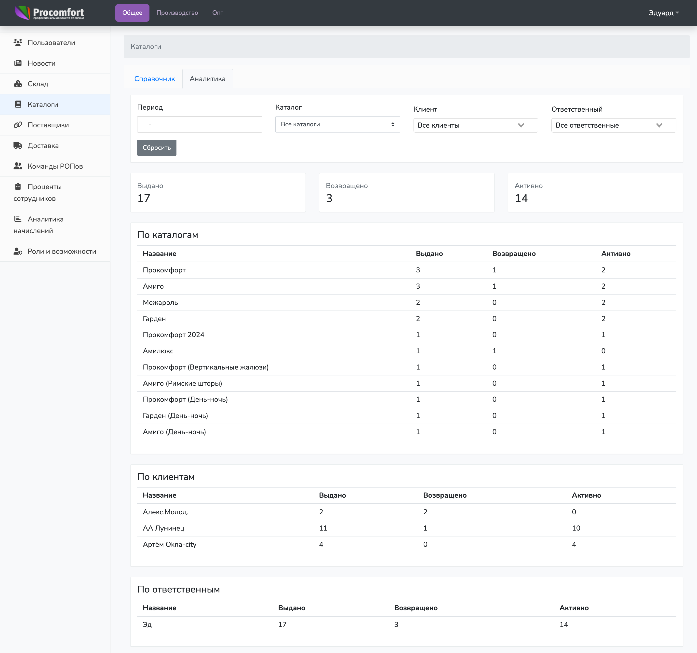

# Инструкция по работе с каталогами клиентов

> **Для кого:** администратор, РОП, менеджер

## 1. Что это за модуль

Модуль `Каталоги клиентов` фиксирует передачу каталогов клиентам и возврат каталогов обратно.

Он нужен, чтобы:

- видеть, какие каталоги сейчас находятся у клиента;
- напечатать бланк передачи одного или нескольких каталогов;
- сохранить историю выдач и возвратов;
- смотреть базовую аналитику по выданным, возвращенным и активным каталогам.

Клиент в этом модуле — пользователь с ролью `Пользователь (дилер)`.

## 2. Где находится в интерфейсе

### 2.1 Карточка клиента

Открыть клиента: `Пользователи` -> нужный клиент -> вкладка `Каталоги`.

На вкладке показываются только **активные** выдачи: то есть каталоги, по которым ещё не зафиксирован возврат.

После возврата строка по этой выдаче **исчезает с этой вкладки** и больше не отображается в списке; данные по ней продолжают учитываться в **аналитике** раздела `Каталоги` → `Аналитика` и в общем учёте на стороне API.

### 2.2 Аналитика

Открыть раздел: `Каталоги` -> вкладка `Аналитика`.

Администратор видит аналитику по всем клиентам. РОП видит аналитику только по своей зоне ответственности.

## 3. Выдать каталог клиенту

1. Открыть карточку клиента.
2. Перейти во вкладку `Каталоги`.
3. Нажать `Выдать каталоги`.
4. В блоке `Позиции` указать каталог и **количество** экземпляров (1–99) для каждой строки. Нужно несколько наименований или несколько экземпляров одной позиции — нажать `Добавить позицию` и заполнить ещё одну строку (либо повысить число в поле количества в существующей строке для одной передачи одного названия).
5. Проверить дату выдачи. По умолчанию установлена сегодняшняя дата.
6. При необходимости заполнить примечание.
7. Нажать `Сохранить и открыть бланк`.

Результат:

- по сохранении создаётся нужное число выдач, они появляются во вкладке `Каталоги` клиента как отдельные строки таблицы;
- общая дата выдачи, ответственный и примечание одни на всю эту операцию (`transfer_uuid`/бланк);
- строки активны до фиксации возврата;
- автоматически открывается предпросмотр бланка в модальном окне (`Печать` внизу модалки, закрыть — крестик сверху).

Важно:

- несколько одинаковых каталогов: либо **несколько строк** с одним наименованием, либо **поле количества** в одной строке — всё входит в **одну** передачу и один общий бланк; во вкладке клиента каждая единица учёта по-прежнему отображается **отдельной строкой**, возврат — по нужной строке;
- несколько торговых точек у одного клиента трактуют как необходимость нескольких экземпляров — см. пункт выше;
- после возврата по одной из записей остальные активные выдачи того же каталога не затрагиваются.

## 4. Вернуть каталог

1. Открыть карточку клиента.
2. Перейти во вкладку `Каталоги`.
3. В строке нужного каталога нажать `Вернуть`.
4. Проверить дату возврата. По умолчанию установлена сегодняшняя дата.
5. Нажать `Зафиксировать возврат`.

Результат:

- у записи заполняется дата возврата;
- каталог исчезает из активного списка клиента;
- запись остается в истории и учитывается в аналитике как возвращенная.

Важно:

- повторно вернуть уже возвращенную запись нельзя;
- дата возврата не может быть раньше даты выдачи.

## 5. Печать

### 5.1 Напечатать бланк передачи

1. Открыть карточку клиента.
2. Перейти во вкладку `Каталоги`.
3. Выдать один или несколько каталогов.
4. После сохранения откроется бланк передачи во всплывающем окне (модальное); закрытие — крестиком в заголовке, печать — кнопкой `Печать` внизу.

Также можно повторно открыть бланк: в строке любого активного каталога из этой передачи нажать `Печать`.
Если в передаче было несколько каталогов, откроется общий бланк всей этой передачи.

Предпросмотр показывает тот же бланк, что уйдёт в печать (без собственной панели «Назад»/«Печать» внутри документа при отображении во фрейме — печать с кнопки модалки).

В бланке указываются:

- наименование клиента;
- передающая организация `ООО "Тролл"`;
- кто передал каталоги;
- дата передачи;
- общее количество экземпляров каталогов (в блоке над таблицей);
- таблица: без повторного перечисления одного названия — для каждой позиции указывается количество (`Кол-во`);
- подписи `Передал` и `Принял`.

## 6. Аналитика

Аналитика находится в разделе `Каталоги`, вкладка `Аналитика`.

Доступные показатели:

- `Выдано` — общее количество выдач за выбранный период и фильтры;
- `Возвращено` — количество выдач, по которым зафиксирован возврат;
- `Активно` — количество каталогов, которые сейчас находятся у клиентов.

Доступные группировки:

- по каталогам;
- по клиентам;
- по ответственным за выдачу.

Доступные фильтры:

- период;
- каталог;
- клиент;
- ответственный.

Фильтры применяются автоматически при изменении значения. Кнопка `Сбросить` очищает все фильтры.

Важно:

- аналитика показывает движение каталогов: выдачи, возвраты и активные записи;
- аналитика пока не считает, по каким каталогам клиент реально делает заказы;
- такая аналитика по заказам может быть добавлена отдельным этапом.

## 7. Ограничения доступа

Ниже **администратор** означает роли с полным доступом к панели по учёту каталогов: главный администратор и администратор.

### Администратор

- Видит активные каталоги любого клиента.
- Может выдать каталог любому клиенту.
- Может зафиксировать возврат по любому активному каталогу.
- Видит общую аналитику по всем клиентам.

### РОП

- Видит активные каталоги своих клиентов и клиентов менеджеров своей команды.
- Может выдать каталог только клиенту в своей зоне ответственности.
- Может зафиксировать возврат только по доступному клиенту.
- Видит аналитику только по своей зоне ответственности.

### Менеджер

- Видит активные каталоги только своих клиентов.
- Может выдать каталог только своему клиенту.
- Может зафиксировать возврат только по своему клиенту.
- Не видит аналитику каталогов.

### Дилер

- Не имеет доступа к этому модулю.

## 8. Частые вопросы

**Почему после возврата строка пропала из вкладки «Каталоги»?**  
Вкладка показывает только невозвращённые выдачи. После возврата строка здесь скрыта, но данные по этой операции сохраняются и учитываются в показателях вкладки `Аналитика` раздела `Каталоги`.

**Можно ли выдать несколько одинаковых каталогов?**  
Да — у нескольких точек нужны отдельные экземпляры. При выдаче укажите количество или добавьте позиции: на бланке одинаковые наименования суммируются в колонку `Кол-во`, во вкладке клиента по-прежнему видны отдельные строки учёта, возврат — по нужной строке.

**Можно ли удалить ошибочную выдачу?**  
Удаление выдач через интерфейс не предусмотрено. Если запись создана ошибочно, нужно зафиксировать возврат и при необходимости создать корректную выдачу.

**Почему в аналитике нет данных по заказам из каталога?**  
Текущая аналитика считает движение каталогов. Связь выданных каталогов с заказами клиента пока не реализована.
